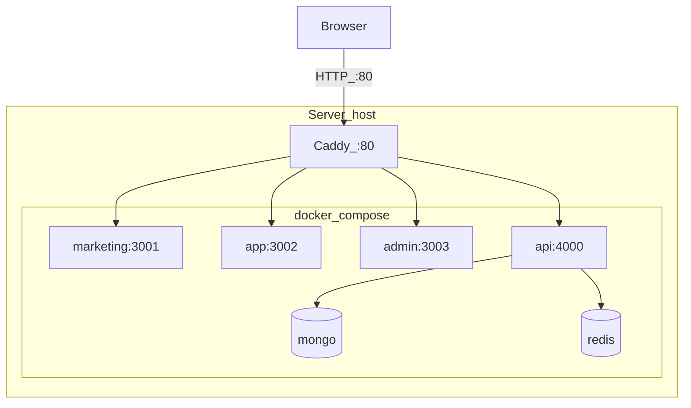
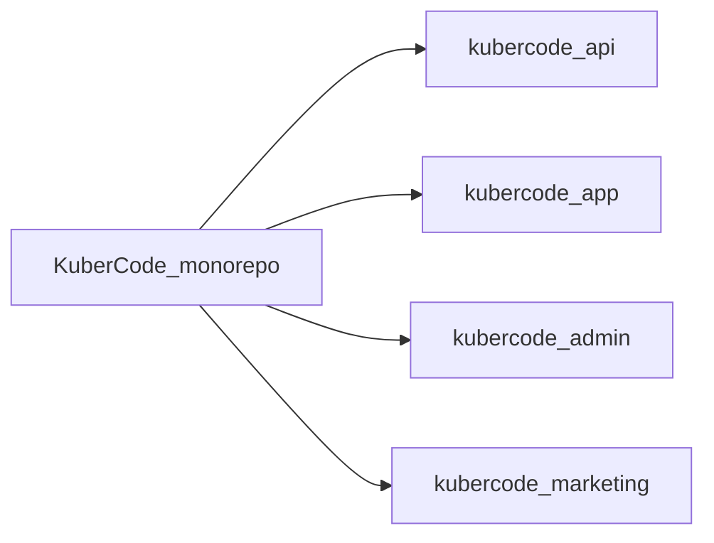
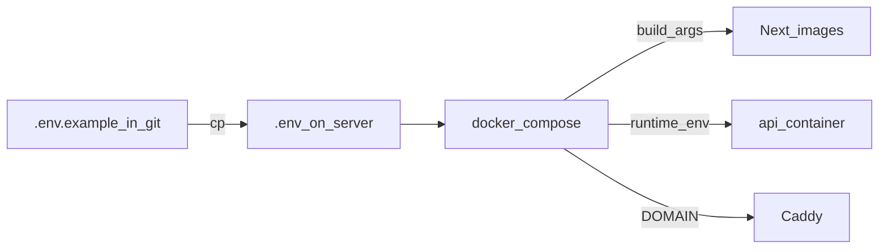
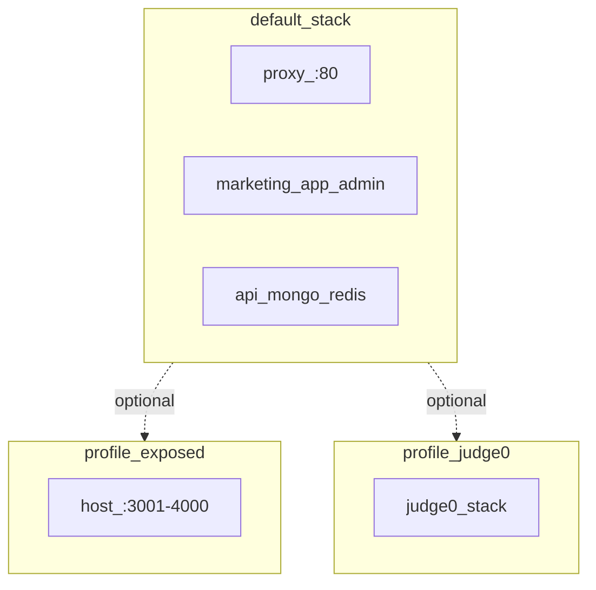
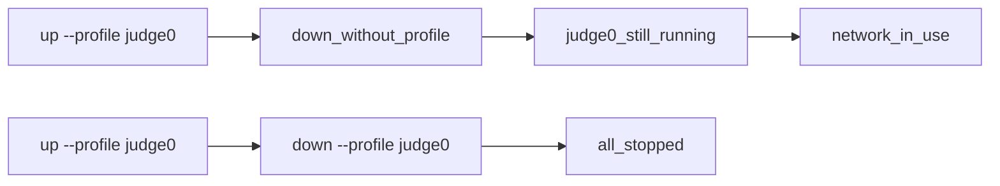
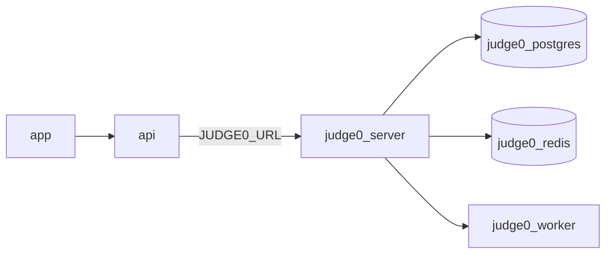
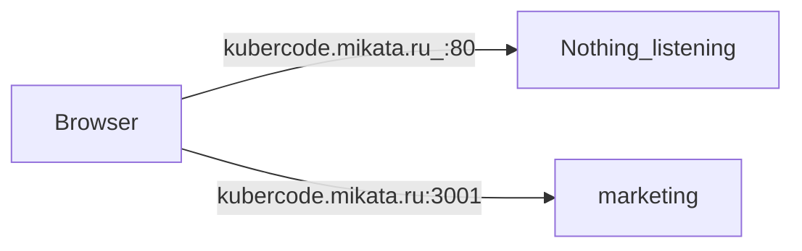
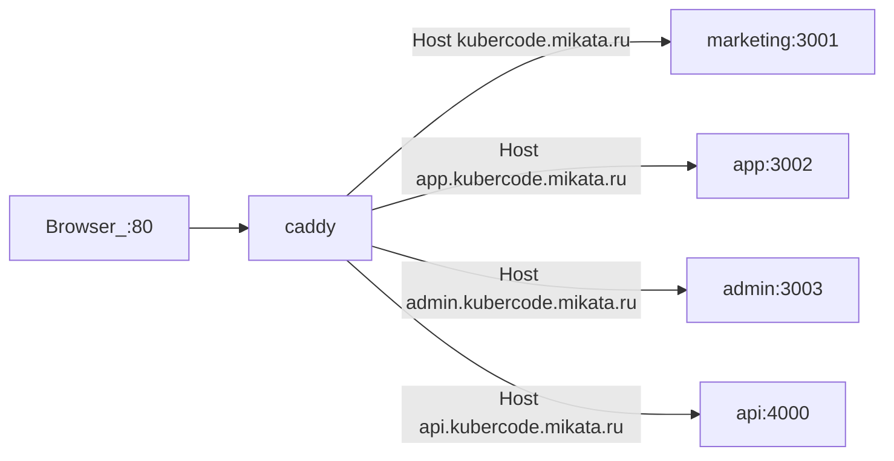

# Запуск KuberCode через Docker

Один clone монорепозитория + `docker-compose.yml` поднимают стек: MongoDB, Redis, API, marketing, app, admin и **Caddy на порту 80** (поддомены без `:3001`).



## Содержание

1. [Установка Docker на Ubuntu](#установка-docker-на-ubuntu)
2. [Clone (submodule)](#clone-монорепо-обязательно-с-submodule)
3. [`.env` — почему его нет в git](#env--почему-его-нет-в-git)
4. [Profiles — важное правило](#profiles--важное-правило)
5. [Запуск без Judge0](#запуск-без-judge0)
6. [Запуск с Judge0](#запуск-с-judge0)
7. [Домен без портов](#домен-без-портов-например-kubercodemikataru)
8. [Переменные окружения](#переменные-окружения)
9. [Типичные проблемы](#типичные-проблемы)
10. [Очистка и сброс](#очистка-и-сброс)

---

## Установка Docker на Ubuntu

На хосте нужны только **Docker Engine + Compose plugin**. Node/Go/Mongo на хост ставить не нужно.

```bash
sudo apt update
sudo apt install -y ca-certificates curl git

sudo install -m 0755 -d /etc/apt/keyrings
sudo curl -fsSL https://download.docker.com/linux/ubuntu/gpg -o /etc/apt/keyrings/docker.asc

# ВАЖНО: режим 0644 (не a644 — будет chmod: invalid digit)
sudo chmod 0644 /etc/apt/keyrings/docker.asc

echo "deb [arch=$(dpkg --print-architecture) signed-by=/etc/apt/keyrings/docker.asc] https://download.docker.com/linux/ubuntu $(. /etc/os-release && echo "$VERSION_CODENAME") stable" | sudo tee /etc/apt/sources.list.d/docker.list > /dev/null

sudo apt update
sudo apt install -y docker-ce docker-ce-cli containerd.io docker-buildx-plugin docker-compose-plugin

docker --version
docker compose version
```

Если работаете не под `root`:

```bash
sudo usermod -aG docker $USER
# затем перелогиньтесь
```

Ресурсы: ≥4 GB RAM (с Judge0 — больше). Файрвол: порт **80** (и при IP-доступе без proxy — 3001–4000).

---

## Clone монорепо (обязательно с submodule)

Вложенные `kubercode-*` — отдельные репозитории. Без submodule после clone папки **пустые**, `docker compose build` падает.



```bash
git clone --recurse-submodules git@github.com:Muniabi/KuberCode-monorepo.git
cd KuberCode-monorepo

# если клонировали без --recurse-submodules:
git submodule update --init --recursive
```

HTTPS:

```bash
git clone --recurse-submodules https://github.com/Muniabi/KuberCode-monorepo.git
cd KuberCode-monorepo
```

После `git pull` на сервере **всегда**:

```bash
git pull
git submodule update --init --recursive
```

---

## `.env` — почему его нет в git

Файл `.env` **намеренно не в репозитории** (секреты JWT, пароли). В git только шаблон **`.env.example`**.



На сервере один раз:

```bash
cp .env.example .env
nano .env   # IP / домен / JWT_* / SEED_ADMIN_PASSWORD
```

Compose читает **корневой** `.env`. Отдельные `kubercode-*/.env` для Docker не нужны.

`NEXT_PUBLIC_*` вшиваются в Next.js на **build**. Сменили URL → обязательно:

```bash
docker compose up -d --build
```

---

## Profiles — важное правило

| Profile | Что добавляет |
|---------|----------------|
| _(нет)_ | mongo, redis, api, marketing, app, admin, **proxy (:80)** |
| `exposed` | прямые порты хоста 3001–4000 (минуя Caddy) |
| `judge0` | Judge0 server/worker + postgres/redis |



**`up` и `down` вызывайте с теми же `--profile`, с которыми поднимали сервисы.**

Иначе типичная ошибка:

```text
docker compose down
! Network kubercode_default Resource is still in use
docker compose ps
# всё ещё крутятся judge0-* …
```



Judge0 (и `*-host` из `exposed`) не останавливаются обычным `down` без профиля.

Правильно:

```bash
# если поднимали с Judge0:
docker compose --profile judge0 down

# если поднимали с Judge0 и exposed:
docker compose --profile judge0 --profile exposed down -v --rmi local
```

Проверка, что всё остановлено:

```bash
docker compose --profile judge0 --profile exposed ps -a
```

---

## Запуск без Judge0

Локальный runner кода внутри контейнера `api` (Go + Node). Для большинства деплоев этого достаточно.

```bash
cd ~/KuberCode-monorepo
git pull && git submodule update --init --recursive

cp .env.example .env   # только если ещё нет
nano .env              # DOMAIN / NEXT_PUBLIC_* / JWT_* / SEED_ADMIN_PASSWORD
# JUDGE0_URL оставьте пустым

docker compose up -d --build
docker compose ps
docker compose logs -f proxy
```

Остановка:

```bash
docker compose down
```

### Localhost через proxy (:80)

В `.env.example` по умолчанию `DOMAIN=localhost` и URL вида `http://app.localhost` (браузеры резолвят `*.localhost` → 127.0.0.1):

| Сервис    | URL                         |
|-----------|-----------------------------|
| Marketing | http://localhost            |
| App       | http://app.localhost        |
| Admin     | http://admin.localhost      |
| API       | http://api.localhost/health |

Прямые порты (отладка):

```bash
docker compose --profile exposed up -d
# http://localhost:3001 … :4000
```

Админ после seed: `admin@kubercode.local` / пароль из `SEED_ADMIN_PASSWORD`.

---

## Запуск с Judge0

1. В `.env`:

```env
JUDGE0_URL=http://judge0-server:2358
```



2. Поднять:

```bash
# вариант A — всё сразу
docker compose --profile judge0 up -d --build

# вариант B — сначала Judge0, потом стек
docker compose --profile judge0 up -d
sleep 15
docker compose up -d --build
```

Проверка:

```bash
curl -s http://127.0.0.1:2358/about
docker compose --profile judge0 ps
```

Остановка **со** стеком Judge0:

```bash
docker compose --profile judge0 down
# с volumes:
docker compose --profile judge0 down -v
```

Нужны Linux и privileged-контейнеры. Конфиг: `kubercode-api/judge0.conf`.

---

## Домен без портов (например kubercode.mikata.ru)

### Почему `kubercode.mikata.ru` «не найден», а `:3001` открывается

Браузер без порта ходит на **:80**. Раньше снаружи слушались только 3001–4000 — на 80 никто не отвечал.  
`kubercode.mikata.ru:3001` работал, потому что вы явно били в marketing.



Сейчас **Caddy (`proxy`)** слушает :80 и разводит по Host:



| Host | Сервис |
|------|--------|
| `kubercode.mikata.ru` | marketing |
| `app.kubercode.mikata.ru` | app |
| `admin.kubercode.mikata.ru` | admin |
| `api.kubercode.mikata.ru` | api |

### 1) DNS

A-записи на IP сервера (пример `201.24.116.55`):

- `kubercode.mikata.ru`
- `app.kubercode.mikata.ru`
- `admin.kubercode.mikata.ru`
- `api.kubercode.mikata.ru`

Или apex + wildcard: `kubercode.mikata.ru` и `*.kubercode.mikata.ru`.

```bash
dig +short app.kubercode.mikata.ru
```

### 2) `.env`

```env
DOMAIN=kubercode.mikata.ru

NEXT_PUBLIC_API_URL=http://api.kubercode.mikata.ru
NEXT_PUBLIC_MARKETING_URL=http://kubercode.mikata.ru
NEXT_PUBLIC_APP_URL=http://app.kubercode.mikata.ru
NEXT_PUBLIC_ADMIN_URL=http://admin.kubercode.mikata.ru
CORS_ORIGINS=http://kubercode.mikata.ru,http://app.kubercode.mikata.ru,http://admin.kubercode.mikata.ru

INTERNAL_API_URL=http://api:4000
MONGODB_URI=mongodb://mongo:27017
REDIS_URL=redis://redis:6379
COOKIE_SECURE=false
```

Порты в публичных URL **не указывайте**. Смените `JWT_*` и `SEED_ADMIN_PASSWORD`.

### 3) Запуск

```bash
cd ~/KuberCode-monorepo
git pull && git submodule update --init --recursive
docker compose up -d --build
# с Judge0:
# docker compose --profile judge0 up -d --build
```

На проде **не** используйте `--profile exposed` (порты 3001–4000 можно закрыть в файрволе). Откройте **80**.

### 4) Проверка

```bash
curl -sI http://kubercode.mikata.ru
curl -sI http://app.kubercode.mikata.ru
curl -s http://api.kubercode.mikata.ru/health

# DNS ещё не готов — проверка через Host на localhost:
curl -sI -H "Host: kubercode.mikata.ru" http://127.0.0.1/
curl -s -H "Host: api.kubercode.mikata.ru" http://127.0.0.1/health
```

HTTPS (Let's Encrypt) — следующий шаг; сейчас HTTP (`auto_https off` в `deploy/Caddyfile`).

---

## Переменные окружения

Единый файл: корневой `.env` (шаблон — `.env.example`).

### Публичные (браузер / Caddy)

| Переменная | Назначение |
|------------|------------|
| `DOMAIN` | Apex для Caddy (`app.$DOMAIN`, …) |
| `NEXT_PUBLIC_API_URL` | API в браузере |
| `NEXT_PUBLIC_MARKETING_URL` | Ссылки на лендинг из app |
| `NEXT_PUBLIC_APP_URL` | Ссылки «в кабинет» из marketing |
| `NEXT_PUBLIC_ADMIN_URL` | URL админки / CORS |
| `CORS_ORIGINS` | Разрешённые origin API (через запятую) |

### Внутренние (docker-сеть, не менять на проде с Compose)

| Переменная | Значение |
|------------|----------|
| `INTERNAL_API_URL` | `http://api:4000` |
| `MONGODB_URI` | `mongodb://mongo:27017` |
| `REDIS_URL` | `redis://redis:6379` |

### Auth / seed / runner

| Переменная | Назначение |
|------------|------------|
| `JWT_ACCESS_SECRET` / `JWT_REFRESH_SECRET` | Секреты токенов — **смените** с дефолта |
| `COOKIE_SECURE` | `true` только за HTTPS |
| `SEED_ON_BOOT` / `SEED_ADMIN_PASSWORD` | Сид админа при старте API |
| `RUNNER_WORKERS` | Воркеры очереди проверки кода |
| `JUDGE0_URL` | Пусто = локальный runner; иначе `http://judge0-server:2358` |

### Порты на хосте

| Переменная | Назначение |
|------------|------------|
| `PROXY_HTTP_PORT` | Caddy, по умолчанию `80` |
| `*_HOST_PORT` | Прямые порты — только с `--profile exposed` |
| `MONGO_HOST_PORT` | Compass с хоста (`27018`) |

### Сценарий: только IP без домена

```env
DOMAIN=localhost
NEXT_PUBLIC_API_URL=http://203.0.113.10:4000
NEXT_PUBLIC_MARKETING_URL=http://203.0.113.10:3001
NEXT_PUBLIC_APP_URL=http://203.0.113.10:3002
NEXT_PUBLIC_ADMIN_URL=http://203.0.113.10:3003
CORS_ORIGINS=http://203.0.113.10:3001,http://203.0.113.10:3002,http://203.0.113.10:3003
```

```bash
docker compose --profile exposed up -d --build
```

---

## Типичные проблемы

### `Network kubercode_default Resource is still in use`

Остались контейнеры из профиля (`judge0` / `exposed`).

```bash
docker compose --profile judge0 --profile exposed down -v --rmi local
docker compose --profile judge0 --profile exposed ps -a

# если сеть всё ещё занята:
docker ps -a --filter name=kubercode-
docker rm -f $(docker ps -aq --filter name=kubercode-)
docker network rm kubercode_default
```

### Домен открывается только с `:3001`

Не запущен `proxy`, не открыт порт 80, или в `.env` всё ещё URL с портами без rebuild. Нужны DNS поддоменов + `DOMAIN` + `NEXT_PUBLIC_*` без портов + `docker compose up -d --build`.

### Пустые `kubercode-*` после clone

```bash
git submodule update --init --recursive
ls kubercode-api kubercode-app kubercode-admin kubercode-marketing
```

### `chmod: invalid digit found in string`

Было `chmod a644` — нужно `chmod 0644` (или `a+r`) на ключ Docker APT.

### Build падает на TypeScript / Next

Сначала обновите submodule до актуального SHA, затем `docker compose build --no-cache admin` (или полный `--build`).

### Сменили домен/IP — сайт всё ещё бьёт на старый URL

`NEXT_PUBLIC_*` запечены в образ. Снова `docker compose up -d --build`.

### CORS / cookies между поддоменами

`CORS_ORIGINS` должен точно совпадать с origin в браузере (схема + хост, без лишнего слэша). При HTTP `COOKIE_SECURE=false`.

---

## Очистка и сброс

Всегда указывайте профили, которые использовали:

```bash
# мягкая остановка (данные в volumes остаются)
docker compose --profile judge0 --profile exposed down

# + удалить volumes (Mongo/Redis/Caddy с нуля)
docker compose --profile judge0 --profile exposed down -v

# + удалить локально собранные образы проекта
docker compose --profile judge0 --profile exposed down -v --rmi local

# пересборка без кэша слоёв
docker compose build --no-cache
docker compose up -d --build

# глобальная чистка Docker (затронет другие проекты на машине)
docker system prune -af
docker builder prune -af
# docker volume prune -f   # ОСТОРОЖНО
```

---

## Полезные команды

```bash
docker compose ps
docker compose --profile judge0 ps
docker compose logs -f proxy
docker compose logs -f api
docker compose restart proxy
docker compose exec api sh
```

Mongo с хоста: `mongodb://127.0.0.1:27018`.

---

## Структура

```
KuberCode-monorepo/
  docker-compose.yml      # стек + Caddy; profiles: exposed, judge0
  deploy/Caddyfile        # Host → marketing / app / admin / api
  .env.example            # шаблон (в git)
  .env                    # секреты и URL (НЕ в git — создаёте на сервере)
  DOCKER.md               # этот файл
  .gitmodules             # submodule → kubercode-*
  kubercode-*/Dockerfile
```

Локальная разработка без полного стека: `kubercode-api/docker-compose.yml` (mongo+redis) + `npm run dev` / `go run`.
