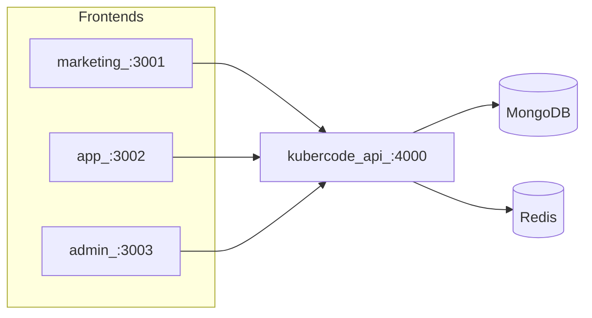
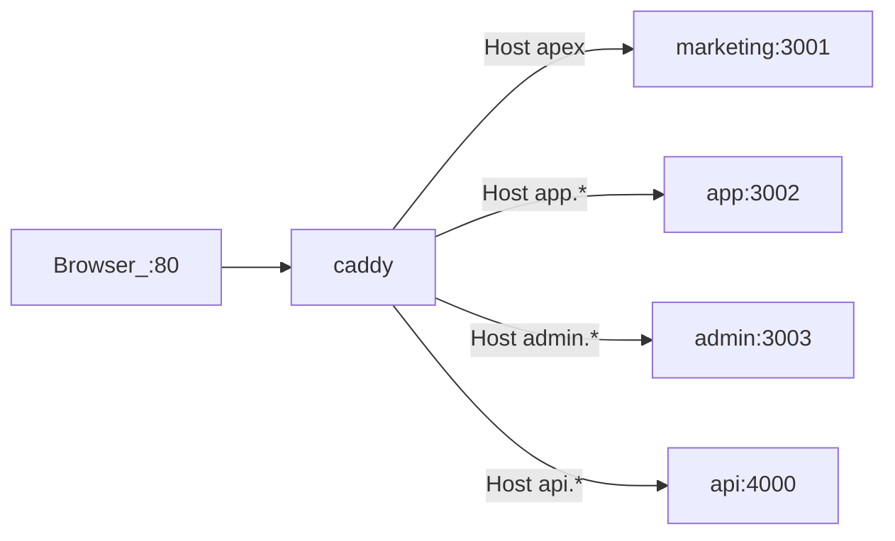

# KuberCode (workspace)

Локальный workspace из независимых репозиториев:



| Папка                 | Домен / порт | Назначение                       | Репо                                                          |
| --------------------- | ------------ | -------------------------------- | ------------------------------------------------------------- |
| `kubercode-marketing` | :3001        | лендинг, SEO, маркетинг          | [KuberCode-v0.3](https://github.com/Muniabi/KuberCode-v0.3)   |
| `kubercode-app`       | :3002        | кабинет, auth UI, треки          | [kubercode-app](https://github.com/Muniabi/kubercode-app)     |
| `kubercode-admin`     | :3003        | CMS: треки, модули, пользователи | [kubercode-admin](https://github.com/Muniabi/kubercode-admin) |
| `kubercode-api`       | :4000        | backend API (Go + Gin + Mongo)   | [kubercode-api](https://github.com/Muniabi/kubercode-api)     |

Подробности: [docs/architecture.md](docs/architecture.md).

## Запуск всего стека через Docker (продакшен / сервер)



```bash
git clone --recurse-submodules git@github.com:Muniabi/KuberCode-monorepo.git
cd KuberCode-monorepo
cp .env.example .env
# DOMAIN + NEXT_PUBLIC_* без портов; JWT_* — см. DOCKER.md
docker compose up -d --build
```

Caddy на **:80** → поддомены `app.` / `admin.` / `api.`.  
`down` с теми же `--profile`, что и `up` (иначе Judge0 останется и сеть будет «in use»).

Полная инструкция, Ubuntu, DNS, типичные ошибки: **[DOCKER.md](DOCKER.md)**.  
CI/CD (GitHub Actions): **[docs/ci-cd.md](docs/ci-cd.md)**.

## Быстрый старт (локальная разработка)

```bash
# 1) MongoDB + Redis — нужен запущенный Docker Desktop
cd kubercode-api
docker compose up -d
# Compass URI: mongodb://127.0.0.1:27018  →  БД kubercode

# 2) API (порт 4000) — seed admin + demo track при SEED_ON_BOOT=true
go mod tidy
go run ./cmd/api

# 3) Marketing (порт 3001)
cd ../kubercode-marketing
npm install
npm run dev

# 4) App (порт 3002)
cd ../kubercode-app
npm install
npm run dev

# 5) Admin (порт 3003)
cd ../kubercode-admin
npm install
npm run dev
```

Admin login (после seed): `admin@kubercode.local` / пароль из `SEED_ADMIN_PASSWORD`.

Каждая папка — отдельный проект со своим git / README.

## Контент упражнений (админка)

Как добавлять задания, starter code и тесты — см. [kubercode-admin/README.md](kubercode-admin/README.md#как-добавлять-задания-и-тесты).

Кратко:

1. Треки → трек → создать упражнение в модуле.
2. **Изменить** → полноэкранный редактор `/exercises/{id}`.
3. Заполнить вкладки: Задание → Код → Тесты → Превью → Сохранить.

План обучения (подписка на трек, теория, мобильный UX): [docs/learning-flow.md](docs/learning-flow.md).

План серверного запуска кода в изоляции и «человеческих» ошибок: [docs/exercise-runner.md](docs/exercise-runner.md).
