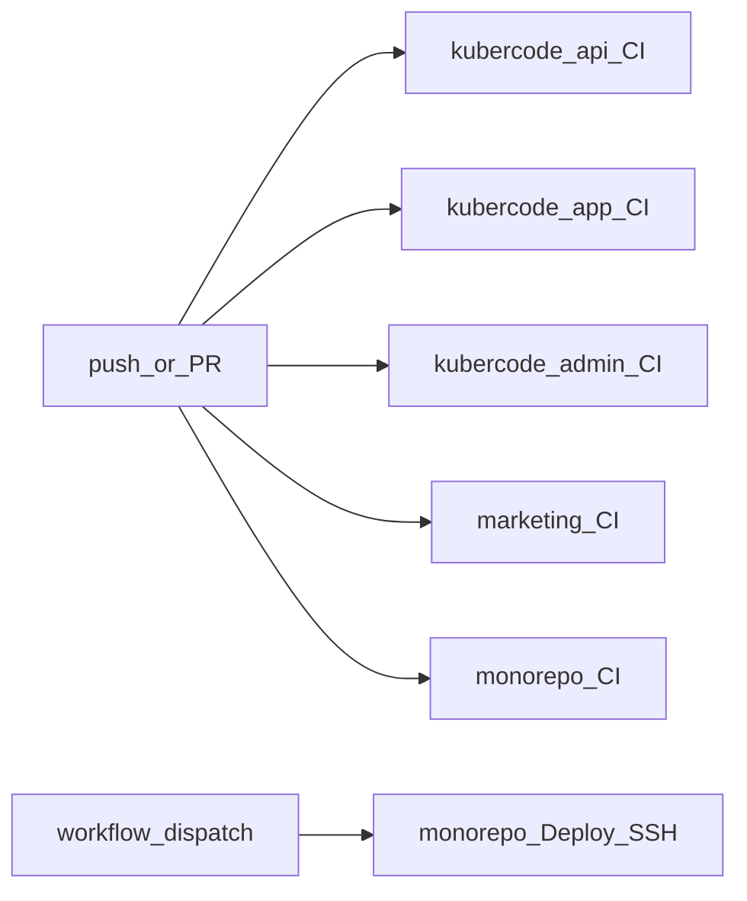

# CI/CD (GitHub Actions)

## Что где лежит

| Репозиторий | Workflow | Что делает |
|-------------|----------|------------|
| `kubercode-api` | `.github/workflows/ci.yml` | `go vet`, `go test`, `go build` |
| `kubercode-app` | `.github/workflows/ci.yml` | `npm ci` → lint → build |
| `kubercode-admin` | `.github/workflows/ci.yml` | `npm ci` → lint → build |
| `KuberCode-v0.3` (marketing) | `.github/workflows/ci.yml` | `npm ci` → lint → build |
| `KuberCode-monorepo` | `.github/workflows/ci.yml` | submodule + `docker compose config` |
| `KuberCode-monorepo` | `.github/workflows/deploy.yml` | SSH: pull + submodule + `compose up --build` |

CI запускается на **push** и **pull_request** в `main`.

На фронтах шаг **Lint** сейчас `continue-on-error: true` (есть техдолг eslint); обязательный гейт — **Build** (TypeScript + Next). API: vet/test/build обязательны.

## Deploy (CD) — секреты

В GitHub → **KuberCode-monorepo** → Settings → Secrets and variables → Actions:

| Secret | Пример |
|--------|--------|
| `DEPLOY_HOST` | `201.24.116.55` или `kubercode.mikata.ru` |
| `DEPLOY_USER` | `root` |
| `DEPLOY_SSH_KEY` | приватный SSH-ключ (целиком, включая `BEGIN`/`END`) |
| `DEPLOY_PATH` | опционально, по умолчанию `~/KuberCode-monorepo` |

На сервере у пользователя должен быть доступ к Docker и уже созданный `.env`.

Запуск: Actions → **Deploy** → Run workflow (галочка Judge0 при необходимости).

Авто-деплой на каждый push в `main` закомментирован в `deploy.yml` — раскомментируйте `push:` когда секреты настроены.

## Environment

Deploy использует GitHub Environment `production` (создаётся при первом запуске). Можно добавить required reviewers в Settings → Environments.
