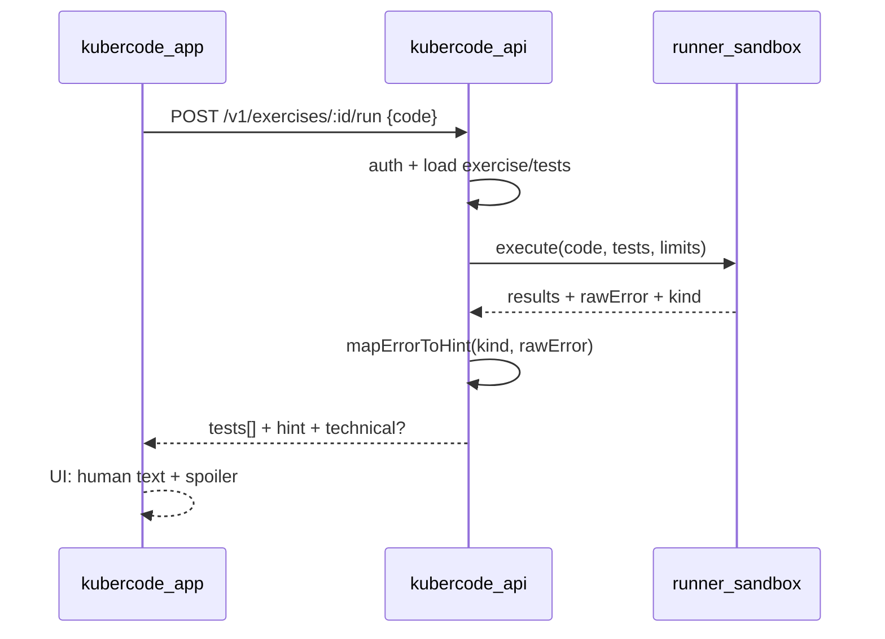

# План: запуск кода в изоляции + понятные ошибки

Общий учебный поток (enrollment, теория, мобильный блок): [learning-flow.md](./learning-flow.md).

Сейчас MVP в `kubercode-app` гоняет тесты **в браузере** (`lib/runner.ts`). Это удобно для демо, но нельзя считать финальным: нет лимитов CPU/памяти, студент может подсмотреть тесты, нет единого источника истины на бэке.

Ниже — целевой поток и UX ошибок для новичков.

## Целевой UX

1. Студент пишет код в редакторе на `/tracks/{slug}/exercises/{id}`.
2. Жмёт **Запустить**.
3. App отправляет код на API.
4. API ставит job в очередь / вызывает runner-сервис.
5. Код и тесты выполняются в **изолированной среде** (sandbox).
6. Результат возвращается в app: список тестов + статус.
7. При ошибке студент сначала видит **простой текст**, а техническую ошибку — под спойлером.



## API (предложение)

### `POST /v1/exercises/:exerciseId/run` (authed)

Request:

```json
{
  "code": "function createCounter() { ... }"
}
```

Response:

```json
{
  "status": "failed",
  "allPassed": false,
  "durationMs": 842,
  "tests": [
    {
      "id": "t1",
      "label": "Первый вызов возвращает 1",
      "passed": true
    },
    {
      "id": "t2",
      "label": "Второй вызов возвращает 2",
      "passed": false,
      "hint": "Функция вернула не то значение. Проверь, увеличивается ли счётчик при каждом вызове.",
      "technical": {
        "message": "Error: Ожидалось 2",
        "kind": "assertion_failed"
      }
    }
  ],
  "runError": null
}
```

Если упал весь прогон (таймаут, синтаксис, бесконечный цикл):

```json
{
  "status": "error",
  "allPassed": false,
  "tests": [],
  "runError": {
    "hint": "Похоже, программа зациклилась и не смогла завершиться вовремя. Проверь условия выхода из цикла.",
    "technical": {
      "message": "Execution timed out after 2000ms",
      "kind": "timeout"
    }
  }
}
```

После успешного `allPassed: true` API также обновляет `exercise_progress` → `completed` и сохраняет `code`.

## Изоляция (MVP → production)

### Фаза A — Node worker в процессе API (быстрый старт)

- Отдельный процесс / worker thread
- Жёсткий timeout (1–3 с)
- Запрет `fs`, `net`, `child_process`, `process.exit`
- Лимит размера кода и stdout
- Только `javascript` сначала

Минусы: слабее изоляция, чем контейнер.

### Фаза B — Docker / gVisor / Firecracker sandbox (цель)

- Один контейнер (или microVM) на run
- Нет сети, read-only FS, CPU/memory limits
- Очередь (Redis / NATS) + горизонтальное масштабирование runner-пула
- Отдельный сервис `kubercode-runner` (можно Go или Node)

Рекомендуемый путь для KuberCode: **A для локальной разработки**, **B перед публичным запуском**.

## Классификация ошибок → человеческий текст

На бэке (или в runner) нормализуем `kind`:

| kind | Когда | Hint для новичка (пример) |
|------|--------|---------------------------|
| `syntax_error` | Parse/SyntaxError | «В коде есть синтаксическая ошибка — проверь скобки, кавычки и точки с запятой.» |
| `timeout` / `infinite_loop` | Превышен лимит времени | «Программа слишком долго работает. Часто так бывает из‑за бесконечного цикла — проверь условие выхода.» |
| `reference_error` | переменная/функция не найдена | «Используется имя, которого нет. Проверь, что функция объявлена и называется так же, как в задании.» |
| `type_error` | null/undefined method | «Код обратился к значению, которого нет. Возможно, функция ничего не вернула.» |
| `assertion_failed` | тест сделал throw | Текст из теста или шаблон: «Проверка не прошла: результат отличается от ожидаемого.» |
| `memory` / `resource` | OOM / слишком большой вывод | «Программа использовала слишком много ресурсов. Упрости решение.» |
| `runtime` | прочее | «Во время выполнения произошла ошибка. Открой подробности ниже, если хочешь увидеть технический текст.» |

Маппинг — таблица regex/кодов в `internal/runner/hints.go` (или аналог). Можно позже обогащать LLM, но **сначала deterministic map**.

## UI результата в app

Для каждого failed теста / `runError`:

1. Иконка X + **hint** крупным понятным текстом
2. Блок-спойлер «Показать техническую ошибку» (`<details>`) с `technical.message` моноширинным шрифтом
3. Успешные тесты — зелёные галочки как сейчас

Не показывать стек трейса целиком новичкам по умолчанию.

## Что оставить на клиенте

- Редактор кода, автосейв черновика (`started` + `code`)
- Оптимистичный UI «Выполняется…»
- Опционально: локальный «быстрый прогон» только в dev — не для production scoring

Источник истины для «задача сдана» — только ответ бэка.

## Порядок внедрения

1. Контракт `POST .../run` + DTO с `hint` / `technical`
2. Фаза A: sandbox worker + timeout + hint mapper
3. UI: human hint + spoiler в `ExerciseWorkspace`
4. Убрать клиентский judge из production path (или оставить как offline preview)
5. Фаза B: вынести runner в контейнеры + очередь
6. Rate limit на run (анти-абуз)

## Связь с админкой

Админ по-прежнему задаёт тесты как `{ id, label, code }`.  
Runner подмешивает `tests[].code` на сервере и **не отдаёт** код тестов в public GET упражнения (в public DTO оставить только `id` + `label`; полный `code` — только для runner).

Это отдельный hardening-шаг при переходе на серверный judge.
