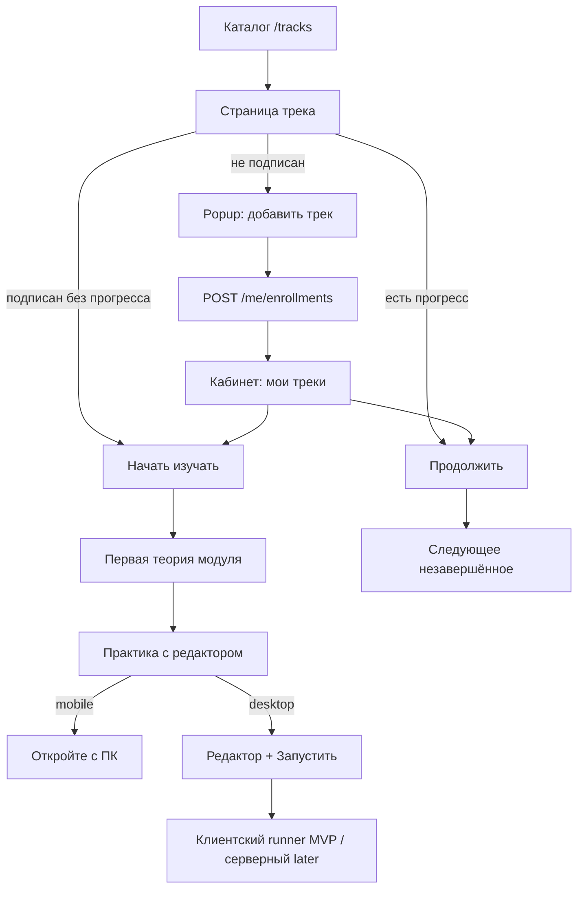

# План: обучение — подписка на трек, теория, практика, мобильный UX

> **Актуальный суперсет:** [implementation-plan-v2.md](./implementation-plan-v2.md)  
> Phase B (Judge0/Docker/auth): [phase-b-sandbox.md](./phase-b-sandbox.md)

Связанный документ по серверному runner: [exercise-runner.md](./exercise-runner.md).

## Цели

1. Студент **явно добавляет трек в профиль** (подтверждение в popup).
2. В кабинете видны **мои треки** с кнопками **Начать изучать** / **Продолжить**.
3. **Первое задание модуля — теория** (`type=tutorial`): статья / видео / ссылки вместо редактора.
4. **Практика с редактором — только с ПК** (на мобиле предупреждение).
5. Дальше — серверный запуск тестов и human-friendly ошибки (см. exercise-runner.md).

## Поток пользователя

## API

| Метод  | Путь                                   | Назначение                                            |
| ------ | -------------------------------------- | ----------------------------------------------------- |
| `POST` | `/v1/me/enrollments`                   | `{ trackId }` — добавить трек                         |
| `GET`  | `/v1/me/enrollments`                   | список треков профиля + progress + continueExerciseId |
| `GET`  | `/v1/me/enrollments/by-track/:trackId` | статус подписки на трек                               |
| `GET`  | `/v1/tracks/:slug/exercises/:id`       | контент задачи (теория или практика)                  |
| `PUT`  | `/v1/me/progress/exercises/:id`        | started/completed + code                              |

Коллекция: `track_enrollments` (`userId` + `trackId` unique).

## Теория vs практика (один workspace)

Одна оболочка `ExerciseWorkspace`:

| Тип        | Левая колонка                                            | Правая колонка                                 |
| ---------- | -------------------------------------------------------- | ---------------------------------------------- |
| `tutorial` | краткое описание + «Отметить прочитанным» / «Продолжить» | `TheoryPanel`: article, video embed, materials |
| `practice` | условие + тесты                                          | редактор + Запустить                           |

Поля теории в Exercise: `article`, `videoUrl`, `materials[]`.  
Админ: вкладка **Теория** на `/exercises/[id]`.

Конвенция контента: **первое упражнение модуля = tutorial**.

## Мобильный UX

- `practice` + viewport `< lg` → экран «Откройте с компьютера» (`DesktopOnlyGate`).
- `tutorial` на мобиле **доступна** (чтение/видео).
- Roadmap трека на мобиле доступен.

## UI кнопки на странице трека

| Состояние              | CTA                                                                      |
| ---------------------- | ------------------------------------------------------------------------ |
| Не enrolled            | **Добавить трек в профиль** → popup → enroll → редирект на первую теорию |
| Enrolled, progress 0%  | **Начать изучать** → firstExerciseId                                     |
| Enrolled, progress > 0 | **Продолжить** → continueExerciseId                                      |

## Порядок реализации (статус)

1. [x] Фикс маршрута GET exercise (перезапуск API) + отдельный ExerciseNotFound
2. [x] Enrollment API + popup + кабинет
3. [x] TheoryPanel + поля article/video/materials
4. [x] Desktop-only gate для практики
5. [ ] Серверный runner + human hints (exercise-runner.md)
6. [ ] Скрыть `tests[].code` из public GET при переходе на серверный judge
