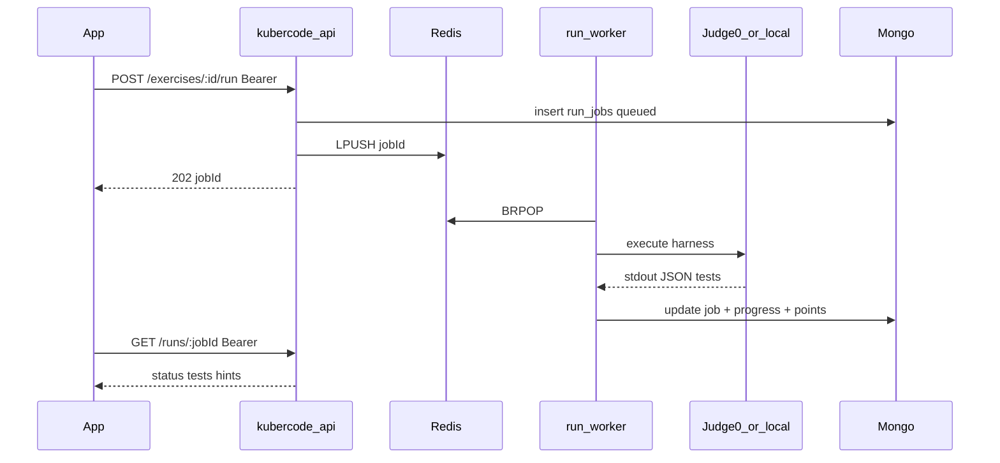

# Phase B — multi-language sandbox, очередь, auth, БД

План после Phase A ([implementation-plan-v2.md](./implementation-plan-v2.md)).

## Зачем

In-process runner (Phase A) не масштабируется на C++/C#/Rust и много пользователей. Phase B выносит исполнение в очередь + Judge0.

## Рекомендуемый инструмент: **Judge0 CE** (self-hosted)

| Критерий | Judge0 | Piston | E2B |
| --- | --- | --- | --- |
| Языки | 60–90+ | очень много | шаблоны VM |
| Изоляция | Isolate + Docker | Isolate + Docker | firecracker/VM |
| API | async submit + poll | sync execute | SDK |
| Fit | **выбран для KuberCode** | проще API | AI-агенты |

App/Admin **не** ходят в Judge0 напрямую — только `kubercode-api` с user JWT.

## Архитектура (реализовано)



### Компоненты в репо

| Файл | Назначение |
| --- | --- |
| [kubercode-api/docker-compose.yml](../kubercode-api/docker-compose.yml) | Mongo + **Redis** (очередь API) |
| [kubercode-api/docker-compose.judge0.yml](../kubercode-api/docker-compose.judge0.yml) | Judge0 CE + Postgres + Redis Judge0 |
| [kubercode-api/judge0.conf](../kubercode-api/judge0.conf) | конфиг Judge0 (dev) |
| `internal/runner/judge0.go` | HTTP-клиент Judge0 + harness JS/Go |
| `internal/runner/languages.go` | language → Judge0 `language_id` |
| `internal/runner/engine.go` | Judge0 → fallback local pool |
| `internal/queue/` | Redis queue + workers |
| `run_jobs` Mongo | jobs + TTL 7 дней |

### Env

```env
REDIS_URL=redis://127.0.0.1:6379
JUDGE0_URL=http://127.0.0.1:2358
JUDGE0_TOKEN=
RUNNER_WORKERS=2
```

Без `JUDGE0_URL` worker использует **local** sandbox (JS/Go), как Phase A — удобно на Windows, пока Judge0 не поднят.

## Деплой sandbox (локально)

### 1. Redis + Mongo (обязательно для /run)

```bash
cd kubercode-api
docker compose up -d
```

Проверка: `redis-cli -p 6379 ping` → `PONG`.

### 2. Judge0 CE (Linux / WSL2 / Linux VM)

Judge0 требует `privileged: true` и стабильнее на Linux (на Windows Docker часто падает).

```bash
cd kubercode-api
docker compose -f docker-compose.judge0.yml up -d db redis
# подождать ~10с
docker compose -f docker-compose.judge0.yml up -d
```

API: http://localhost:2358/docs

В `.env` API:

```env
JUDGE0_URL=http://127.0.0.1:2358
```

Перезапустить API. В `/health` будет `"judge0": true`.

### 3. App flow

1. Студент жмёт **Проверить**
2. `POST /v1/exercises/:id/run` → `202 { jobId }`
3. App поллит `GET /v1/runs/:jobId` до `passed|failed|error`
4. Клиентский judge **отключён** (только локальный «Запустить» для console.log)

## Auth-матрица

| Метод | Путь | Auth |
| --- | --- | --- |
| GET | `/v1/tracks*` | public |
| GET | `/v1/tracks/:slug/exercises/:id` | public, **без** `tests.code` |
| POST | `/v1/exercises/:id/run` | **user JWT** |
| GET | `/v1/runs/:jobId` | **user JWT**, только свой job |
| `/v1/me/*` | | **user JWT**, userId только из токена |
| GET | `/v1/me/leaderboard` | **user JWT**, без email |
| `/v1/admin/*` | | **admin** |

Никогда не принимать `userId` из body для чужих данных.

## Language map (фрагмент)

| language | Judge0 id |
| --- | --- |
| javascript | 63 |
| typescript | 74 |
| go | 60 |
| python | 71 |
| cpp | 54 |
| csharp | 51 |
| rust | 73 |
| java | 62 |

## Дальше (не в этом PR)

- Отдельные runners для Docker/K8s labs
- Webhook от Judge0 вместо wait/poll внутри worker
- Горизонтальное масштабирование worker-реплик
- Production secrets для Judge0/Postgres
