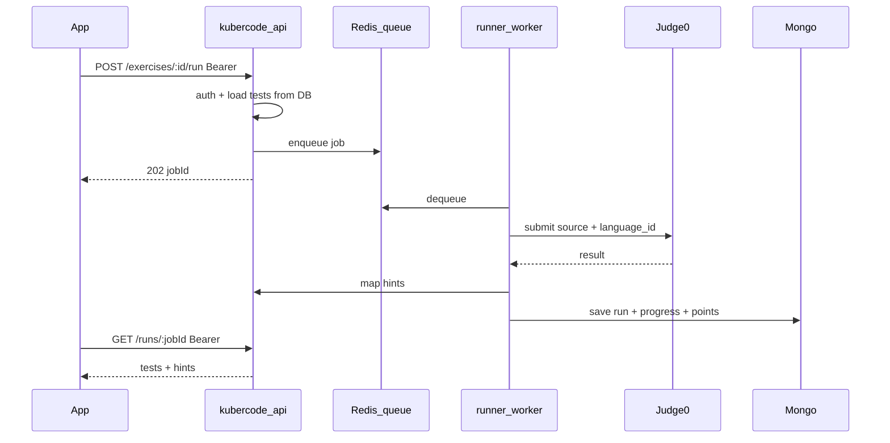

# Phase B — multi-language sandbox, очередь, auth, БД

План **следующего** этапа после Phase A ([implementation-plan-v2.md](./implementation-plan-v2.md)).

## Зачем

Сейчас runner — in-process (`node` / `go test` на машине API). Это ок для локалки и JS/Go, но нельзя масштабировать на C++, C#, Rust, Docker/K8s-задачи и много пользователей.

## Рекомендуемый инструмент: **Judge0** (self-hosted)

| Критерий | Judge0 | Piston | E2B |
| --- | --- | --- | --- |
| Языки | 60–90+ | очень много | шаблоны VM |
| Изоляция | Isolate + Docker | Isolate + Docker | firecracker/VM |
| API | async submit + poll / webhook | sync execute | SDK |
| Self-host | Docker Compose | Docker Compose | cloud-first |
| Fit для KuberCode | **лучший выбор** для edu + много языков | проще API, но public API ограничен | скорее AI-агенты |

**Решение Phase B:** self-host **Judge0 CE** за нашим API. App/Admin **не** ходят в Judge0 напрямую — только `kubercode-api` с user JWT.

Альтернатива позже: Piston (MIT) если нужен simpler sync API; Rustbox — если узкий набор языков и жёсткий latency.

Для задач «поднять контейнер / манифест k8s» — отдельные runners (не Judge0): ephemeral Docker/kind job с жёсткими лимитами и отдельной очередью.

## Архитектура Phase B

## Auth-матрица (обязательно)

Правило: **всё персональное — только с Bearer токена пользователя**. Public — каталог.

| Метод | Путь | Auth | Примечание |
| --- | --- | --- | --- |
| GET | `/v1/tracks` | public | каталог |
| GET | `/v1/tracks/:slug` | public | roadmap без чужого прогресса |
| GET | `/v1/tracks/:slug/exercises/:id` | public | **без** `tests.code` |
| POST | `/v1/exercises/:id/run` | **user** | свой код |
| GET | `/v1/runs/:jobId` | **user** | только свой job |
| GET/PUT | `/v1/me/progress*` | **user** | только свой userId из JWT |
| GET/POST | `/v1/me/enrollments*` | **user** | |
| GET | `/v1/me/stats` | **user** | |
| GET | `/v1/me/leaderboard?track=` | **user** (или public aggregate) | без чужих email |
| * | `/v1/admin/*` | **admin** | |

Никогда не принимать `userId` из body для выдачи чужих данных — только из JWT.

## БД (новые коллекции)

- `run_jobs` — jobId, userId, exerciseId, status, result, createdAt
- `user_track_scores` — optional denormalized (или оставить `enrollments.points`)
- индексы: `{userId, exerciseId}` unique на progress; TTL на старые run logs

## Очередь и параллельность

- Redis + workers (N реплик)
- Rate limit: N runs / мин на user
- Per-language concurrency caps (Go compile тяжелее JS)
- Dead-letter для упавших jobs

## Docker / Kubernetes задачи (отдельный трек позже)

Не смешивать с Judge0:
- Отдельный `kind: docker|k8s` у exercise
- Worker с DinD или remote Docker API в изолированной сети
- Жёсткий timeout, no host mounts, resource quotas
- Результат = exit code + structured checks (не произвольный shell от студента без sandbox)

## Порядок Phase B

1. Поднять Judge0 через Docker Compose рядом с API
2. Адаптер `internal/runner/judge0.go` + language_id map
3. Async jobs + Redis
4. App: polling /runs/:id
5. Скрыть client fallback judge полностью
6. Auth audit всех `/me` и `/run`
7. Leaderboard (опционально)
8. Документация деплоя sandbox
